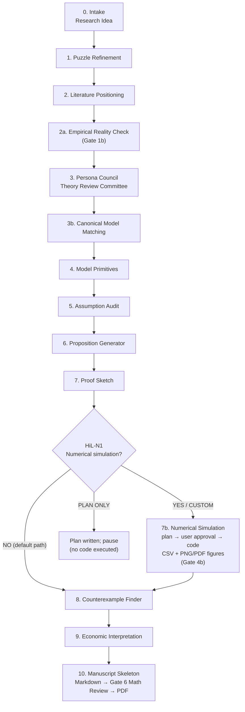

<a href="https://doi.org/10.5281/zenodo.20686025"></a>
# pAI-Econ-claude

<p align="center">
  
  
  
  
  
</p>

<p align="center">
  <b>A Claude Code Skill for human-in-the-loop theoretical economics research</b><br>
  pAI-Econ-claude bridges empirical findings and theoretical modeling — it helps empirical
  researchers translate economic phenomena, mechanism intuitions, and empirical findings into
  clearer theoretical questions, canonical model references, testable propositions, and auditable
  research frameworks.
</p>

<p align="center">
  <a href="./README.md">中文版本</a> ·
  <a href="#quick-start">Quick Start</a> ·
  <a href="#use-cases">Use Cases</a> ·
  <a href="#model-library">Model Library</a> ·
  <a href="#workflow">Workflow</a>
</p>

> pAI stands for principal Agentic Investigator (Abdelmoneum, Beneventano, & Poggio, 2026).

---

## Authors

**Authors:**

Chen Zhu (China Agricultural University)

Xiaolu Wang (China Agricultural University)

Weilong Zhang (University of Cambridge)

**Last updated:** July 9, 2026 

---

## Acknowledgements

This project is inspired by **pAI/MSc** and adapts its research pipeline ideas into a Claude Code Skill for theoretical economics.

Original pAI/MSc:
- Mahmoud Abdelmoneum
- Pierfrancesco Beneventano
- Tomaso Poggio
- MIT + Perseus Labs

Reference:
- [pAI/MSc: ML Theory Research with Humans on the Loop](https://arxiv.org/abs/2604.20622)
- [PoggioAI_MSc GitHub Repository](https://github.com/PoggioAI/PoggioAI_MSc-claude)

**Feedback:  Gin, Luo Zijun**

**Model library contributions: [hayeszhou](https://github.com/hayeszhou)** (spatial DSGE and trade–labor dynamics entries, PR #3)

---

## Overview

**pAI-Econ-claude** is a **human-in-the-loop Claude Code Skill** designed for empirical economists who want to strengthen the theoretical foundations of their research.

It does not attempt to replace the original work of theoretical economists, nor does it claim to automatically discover new theoretical frontiers. Instead, it bridges theory and empirics: helping empirical researchers identify appropriate canonical model families, clarify core economic mechanisms, pinpoint what a model extension adds beyond existing theory, and translate empirical questions into more rigorous theoretical frameworks.

Many empirical papers do not lack data, identification strategies, or estimation results — what is often weak is the theoretical mechanism: Why should this phenomenon hold? Which canonical model does it correspond to? What does adding a new variable change? Are propositions merely implied by assumptions? Do welfare implications extend beyond estimation results?

pAI-Econ-claude provides a structured workflow for these questions. Through canonical model matching, theory lineage checks, model primitive generation, assumption audits, candidate propositions, proof sketches, and counterexample checks, it helps researchers transform an empirical puzzle into a theoretical framework that can be discussed, reviewed, and collaboratively developed.

In short, it is not an AI theoretical economist — it is a theory modeling scaffold for empirical researchers:

> Helping you understand where your empirical findings fit in the theoretical literature, what mechanism is missing, and what questions to bring to a theory collaborator.

---

## What Problem Does It Solve?

The theoretical analysis component of economics research often stalls not at "how to write it" but at much earlier stages:

- Is the research question actually clear?
- Which canonical model tradition does this idea belong to?
- What exactly does the new mechanism add relative to the canonical model?
- Are assumptions too strong — included only to deliver the desired conclusion?
- Are propositions non-trivial, or merely implied by assumptions?
- What are the gaps in proof sketches?
- Do simple counterexamples exist?
- Does the economic interpretation extend beyond the formal results?

**pAI-Econ-claude's role is to make the theory modeling process explicit, documented, and traceable, while preserving human judgment at critical decision points.**

---

## Target Users & Usage Responsibility

### Target Users

This Skill is designed for **junior researchers with foundational training in economic theory**, including:

- Graduate students (Master's or PhD) in economics, management, or related fields
- Assistant professors or postdoctoral researchers whose primary work is empirical but who want to strengthen theoretical mechanisms
- Researchers familiar with microeconomic foundations (utility maximization, equilibrium concepts, information structures)

Using this Skill requires the following baseline competencies:

- Ability to independently judge whether an equilibrium concept (e.g., BNE, SPE, competitive equilibrium) is appropriate for a given research setting
- Ability to assess whether a proposition is non-trivial or merely implied by assumptions
- Ability to evaluate whether a theoretical mechanism has a meaningful correspondence with an empirical identification strategy

**This Skill is not designed for researchers with no background in economic theory modeling.** Users who cannot independently assess the quality of AI-generated model structures and propositions cannot take appropriate academic responsibility for the outputs.

### Usage Responsibility

> **Users bear full responsibility for any work they publish.**

This Skill is an assistive tool. All outputs — including model primitives, propositions, proof sketches, manuscript frameworks, and references — must be independently reviewed by the user before being used for any academic writing or publication purpose.

Specifically:

- **Proof sketches are not formal proofs.** Steps labeled `GAP` or `FALSE_RISK` must be independently derived and verified by the researcher before being written into a paper.
- **References must be independently verified.** Although Stage 2 and the pre-PDF generation step include mandatory web verification nodes, the researcher bears full responsibility for the accuracy of the final published citation list.
- **Theoretical contribution requires researcher judgment.** AI cannot determine whether a proposition has sufficient novelty to meet journal standards — this judgment must be made by the researcher and collaborators based on thorough knowledge of the relevant literature.
- **Model selection requires researcher evaluation.** Canonical Model Matching recommendations are advisory only; the researcher must make the final selection based on their own understanding of the relevant theoretical tradition.

The authors of this project accept no responsibility for the accuracy, originality, or sufficiency of any content generated using this Skill in academic publication.

---

## Quick Start

### Installation

```bash
git clone https://github.com/maxwell2732/pAI-Econ-claude.git
cd pAI-Econ-claude
```

Use either host-specific entry point from that directory:

```text
# Claude Code
/theoretical-economics-claude-skill "Your theoretical economics research idea"

# Codex
$theoretical-economics-claude-skill Your theoretical economics research idea
```

---

## Use Cases

pAI-Econ-claude supports theoretical ideas at different stages of maturity. You don't need to run the full pipeline every time — choose the entry point that fits your task.

### 1. Model Extension Mode: Extend a Canonical Model with a New Mechanism

Use this mode when you already know the approximate model family and want to add a new mechanism.

Example:

```text
/theoretical-economics-claude-skill "
mode: model_extension

Extend a search model by adding product healthfulness and costly attention to nutrition labels.
Can a front-of-package label increase the probability that consumers choose healthier food?
"
```

The Skill will help you answer:

- Which canonical search model does this idea inherit from?
- What does the new healthfulness mechanism change?
- When will consumers actively check nutrition labels?
- Does reducing information costs necessarily increase purchases of healthy food?
- Are there counterexamples or boundary cases?
- Does this extension have sufficient theoretical contribution?

---

### 2. Phenomenon-to-Model Mode: Match a Theoretical Model to an Economic Phenomenon

Use this mode when you have a phenomenon or mechanism intuition but are unsure which theoretical model to use.

Example:

```text
/theoretical-economics-claude-skill "
mode: phenomenon_to_model

I want to incorporate genetic endowment into a health capital framework.
Genetic endowment affects productivity through childhood environment, health investment,
and human capital formation. Which theoretical model is most suitable?
"
```

The Skill will compare multiple candidate model families, such as:

- Grossman health capital model
- Becker / Ben-Porath human capital investment model
- Cunha-Heckman skill formation framework
- Roy model of comparative advantage
- Lifecycle investment model
- Intergenerational human capital model

It will then recommend a baseline model and explain why others do or do not fit.

---

### 3. Model Critique Mode: Audit an Existing Theoretical Model

If you already have model primitives, assumptions, or propositions, you can ask the Skill to review them like a theory journal referee.

```text
/theoretical-economics-claude-skill "
mode: model_critique

Here is my model setup:
[Paste model primitives, timing, utility function, equilibrium definition, and propositions]

Please audit model coherence, assumptions, non-triviality, proof gaps, and possible counterexamples.
"
```

Key checks include:

- Is the model closed?
- Is the timing clear?
- Is the information structure complete?
- Is the equilibrium concept appropriate?
- Are assumptions included merely to deliver desired conclusions?
- Are propositions non-trivial?
- Are there logical jumps in proof sketches?
- Do simple 2-agent, 2-period, binary-action counterexamples exist?

---

### 4. Full Pipeline Mode: Run the Complete Theory Workflow from a Research Idea

Use the full pipeline when you have only an early-stage idea and want to go from intuition all the way to a paper framework.

```text
/theoretical-economics-claude-skill "
mode: full_pipeline

Investigate whether a principal facing a privately informed agent can achieve first-best efficiency
through a forcing contract when the agent's outside option is type-dependent.
"
```

Full output includes:

- Refined research puzzle
- Literature positioning plan
- Canonical model match
- Model primitives
- Assumption audit
- Candidate propositions
- Proof sketches
- Counterexamples
- Economic interpretation
- Manuscript skeleton (markdown + LaTeX source + academic PDF compiled with pdflatex)

---

### 5. Manuscript Skeleton Only: Generate a Paper Framework

Use this mode when the model, propositions, and main conclusions are reasonably clear and you just need to organize them into a working paper structure.

```text
/theoretical-economics-claude-skill "
mode: manuscript_skeleton_only

Here are my model, propositions, and proof sketches:
[Paste existing content]

Please organize them into a theoretical economics working paper skeleton.
"
```

---

## Workflow

pAI-Econ-claude uses a staged, traceable human-AI collaboration process.

**About Stage 2a — Empirical Reality Check:**

After literature positioning and before entering theoretical modeling, the pipeline runs a minimal empirical reality check (Stage 2a) protected by **Gate 1b (Reality Fit Gate)**. The purpose is to verify — using web search — that the researcher's described real-world context is consistent with the factual requirements of the proposed model structure. Specifically, it checks:

- Does the market's actual concentration data support a "dominant firm + atomistic fringe" structure, or is it actually an oligopoly?
- Are important strategic competitors being omitted?
- Is a differentiated-product market being incorrectly modeled as a homogeneous good?
- Are distribution or regulatory constraints being mischaracterized as production capacity constraints?
- Is there documented evidence for claimed urban-rural, regional, or group differences?

Gate 1b produces three verdicts:
- **PASS**: Factual assumptions match available evidence — proceed to Stage 3.
- **CONDITIONAL PASS (REFRAME)**: Some assumptions are unverified — the pipeline can proceed, but the paper must explicitly describe a *stylized* market rather than claiming to describe a specific real market.
- **FAIL (REROUTE)**: A core assumption is contradicted by evidence — loop back to Stage 1 to restate the research context, or redirect Stage 3b to a more appropriate canonical model family.

**About Stage 7b — Numerical Simulation and Computational Illustration (optional):**

> Numerical simulation is optional and runs only after explicit user approval. When selected, the workflow produces reproducible code, machine-readable results, and figures in both PNG and PDF formats. Numerical evidence is used for verification, counterexample search, and illustration, not as a substitute for formal proof.

After Stage 7 (Proof Sketch) completes, the pipeline always pauses at **HiL-N1** and asks whether to run numerical simulation. The full branching logic:

```text
Stage 7 — Proof Sketch (+ Gate 4)
  → Ask user whether to run numerical simulation (HiL-N1)
      NO        → proceed directly to Stage 8 (no numerical artifacts created)
      PLAN ONLY → generate numerical_simulation_plan.md and pause (no code executed)
      CUSTOM    → collect user specifications (propositions, variables, ranges,
                  axes, simulation types, figure formats) → generate plan
      YES       → generate plan
  → user approves plan (HiL-N2 — no code may run before APPROVE PLAN)
  → generate code → run simulation → save machine-readable CSV results
  → generate PNG and PDF figures
  → Gate 4b — Numerical Integrity Gate
  → human review of numerical results (HiL-N3)
  → Stage 8 — Counterexample Finder (with numerical handoff)
```

Every parameter is classified (theoretical normalization / empirically grounded / illustrative / user specified), every numerical result carries an epistemic-status label (e.g., `NUMERICALLY VERIFIED FOR SPECIFIED PARAMETERS`, `COUNTEREXAMPLE FOUND`, `NOT A PROOF`), and figures enter the manuscript only if the researcher explicitly selects `USE FIGURES IN MANUSCRIPT` at HiL-N3 (when authorized, the manuscript includes 1–2 demonstration figures in the main text by default; the rest stay in the workspace or Appendix). A numerical counterexample to a core proposition blocks the unmodified proposition from Stage 10 until it is resolved at Stage 8 / HiL-6.

**About Gate 6 — Mathematical Review Gate (added in v1.3.0):**

After `manuscript.tex` is written and before the PDF is compiled, the pipeline runs a mandatory mathematical audit of the full manuscript. The gate was motivated by an observed failure mode: equilibrium equations and first-order conditions wrapped in `proposition` environments and presented as results. Five checks:

- **Statement classification** — every theorem-like environment (definition / assumption / lemma / proposition / corollary / remark) must contain the kind of statement its label claims; equilibrium conditions, FOCs, and identities belong in the model setup and must never carry a Proposition label
- **Independent re-derivation** — every displayed derivation (FOCs, closed forms, comparative-statics signs) is first re-derived from the model primitives and then compared with the manuscript term by term, so the reviewer's algebra is never anchored by the manuscript's
- **Notation consistency** — symbols defined before use; no symbol denotes two different objects
- **Statement–proof match** — the proof's conclusion must be exactly the stated claim, with matching quantifiers (a "for all parameters" claim verified only at a baseline case fails)
- **Domain and boundary sanity** — division by zero, logarithms of non-positive expressions, missing interiority conditions

Low-level errors (mislabels, algebra slips that change no claim's direction) are corrected directly and back-propagated to the upstream files (`candidate_propositions.md`, `proof_sketches.md`), all logged in the error table of `gates/gate-06-math-review.md`. Substantive errors (a sign contradicted by re-derivation, a proof that fails to establish its claim) pause the pipeline under the standard gate-failure protocol. The PDF cannot be compiled until the gate passes.

Two matching checks were added upstream: Gate 3 now includes a statement-classification test (Check E) at the proposition-generation source, and Gate 4 now includes an independent re-derivation test (Check 7) for the key algebra in proof sketches.



---

## Core Stages

| Stage | Name | Primary Output |
|---|---|---|
| 0 | Intake | `research_intake.md` |
| 1 | Puzzle Refinement | `research_puzzle.md` |
| 2 | Literature Positioning | `literature_positioning.md` |
| **2a** | **Empirical Reality Check** | `empirical_reality_check.md` |
| 3 | Theory Persona Council | `persona_council.md` |
| 3b | Canonical Model Matching | `canonical_model_match.md` |
| 4 | Model Primitives | `model_primitives.md` |
| 5 | Assumption Audit | `assumption_audit.md` |
| 6 | Proposition Generator | `candidate_propositions.md` |
| 7 | Proof Sketch | `proof_sketches.md` |
| **7b** | **Numerical Simulation (optional, user opt-in)** | `numerical_simulation_report.md` + `numerical_code/` + `numerical_results/` + `numerical_figures/` (PNG + PDF) |
| 8 | Counterexample Finder | `counterexamples_and_edge_cases.md` |
| 9 | Economic Interpretation | `economic_interpretation.md` |
| 10 | Manuscript Skeleton | `manuscript_skeleton.md` + `manuscript_skeleton.tex` + `manuscript_skeleton.pdf` |

---

## Model Library

pAI-Econ-claude includes a `model_library/` for matching canonical theoretical model families before formal modeling begins.

This step is critical because theoretical economics research should not start from scratch by "inventing models from thin air" — it should first answer:

> What canonical model does the current research idea most closely resemble?  
> What does it inherit? What does it change? Where is the new mechanism?

### General Theoretical Model Library

| Model Family | Applicable Questions |
|---|---|
| Consumer Choice | Consumer choice, utility maximization |
| Indirect Utility / Expenditure Minimization | Duality problems in consumer theory |
| Discrete Choice / Random Utility | Discrete choice, heterogeneous preferences |
| Search Models | Search costs, stopping rules, information acquisition |
| Costly Information Acquisition | Attention costs, cognitive costs, information processing |
| Rational Inattention | Limited attention, information capacity constraints |
| Signaling | Signaling, education signals, quality signals |
| Screening | Mechanism design under adverse selection |
| Moral Hazard | Hidden action, incentive contracts |
| Adverse Selection | Lemon markets, unobservable quality |
| Hotelling / Product Differentiation | Product differentiation, spatial competition |
| Disclosure / Persuasion | Information disclosure, Bayesian persuasion |
| Mechanism Design | Revelation principle, incentive compatibility |
| Matching Models | Two-sided matching, assignment markets |
| Social Learning | Herding behavior, information cascades |
| Dynamic Optimization | Bellman equations, lifecycle choices |
| OLG / Life-Cycle Models | Overlapping generations, lifecycle investment |
| Principal-Agent | Contract design, delegation |
| General Equilibrium | Competitive equilibrium, market clearing |
| Political Economy | Voting, collective choice, institutional design |

---

### Industrial Organization Library

| Model Family | Applicable Questions |
|---|---|
| Oligopoly Competition | Cournot quantity competition, Bertrand price competition, Stackelberg first-mover advantage |
| Entry Deterrence | Limit pricing, capacity commitment, deterrence vs. accommodation |
| Two-Sided Markets / Platforms | Platform pricing, indirect network effects, platform competition |
| Price Discrimination | First/second/third-degree PD, versioning, market segmentation |

---

### International Trade Library

See [`model_library/international_trade/INDEX.md`](model_library/international_trade/INDEX.md) for the full routing index. The specialized library contains 25 cards and retains six root trade cards for compatibility and cross-reference.

When a question involves international trade, trade policy, tariffs, global value chains, supply chains, firm-to-firm trade, buyer-seller matching, production networks, dynamic adjustment, spatial trade, or trade-related welfare analysis, Stage 3b must recursively scan this directory and jointly check the general Search, Matching, Dynamic Optimization, and General Equilibrium cards. The baseline and extensions must jointly state the mechanism, data requirements, and welfare-analysis path.

| Group | Model Card | Applicable Questions |
|---|---|---|
| Foundations and quantitative trade | [Eaton–Kortum](model_library/international_trade/eaton-kortum-ricardian-gravity.md) | Multicountry Ricardian trade, technology, trade costs, and gravity |
|  | [Armington / Structural Gravity](model_library/international_trade/armington-structural-gravity.md) | Origin differentiation, multilateral resistance, and structural gravity |
|  | [ACR Welfare](model_library/international_trade/acr-welfare-sufficient-statistics.md) | Domestic expenditure shares, trade elasticities, and sufficient-statistic welfare |
|  | [Caliendo–Parro](model_library/international_trade/caliendo-parro-multisector-trade.md) | Multisector input-output trade, tariff propagation, and counterfactuals |
|  | [Quantitative Trade Counterfactuals](model_library/international_trade/quantitative-trade-counterfactuals.md) | Exact-hat algebra and disciplined counterfactual implementation |
| Firms, sourcing, and global value chains | [EKK Firm-to-Firm Trade](model_library/international_trade/ekk-firm-to-firm-trade.md) | Importer-exporter matching and firm/labor-market effects |
|  | [Multiproduct Firms](model_library/international_trade/multiproduct-firms-trade.md) | Product scope, core competence, and trade liberalization |
|  | [Antràs–Helpman Global Sourcing](model_library/international_trade/antras-helpman-global-sourcing.md) | Heterogeneous firms, organizational boundaries, and incomplete contracts |
|  | [Grossman–Helpman Outsourcing](model_library/international_trade/grossman-helpman-outsourcing.md) | Search, matching, and integration-versus-outsourcing choices |
|  | [Antràs–Chor Global Value Chains](model_library/international_trade/antras-chor-global-value-chains.md) | Sequential production, contractibility, and stage allocation |
| Production networks and supply chains | [Input-Output Production Networks](model_library/international_trade/input-output-production-networks.md) | Fixed input-output networks and shock propagation |
|  | [Acemoglu–Azar Endogenous Networks](model_library/international_trade/acemoglu-azar-endogenous-production-networks.md) | Endogenous supplier sets and sectoral network adjustment |
|  | [Oberfield Input-Output Architecture](model_library/international_trade/oberfield-input-output-architecture.md) | Firm supplier choice and endogenous industry structure |
|  | [Production Network Formation, Trade, and Welfare](model_library/international_trade/production-network-formation-trade-welfare.md) | Cross-border buyer-seller link formation, trade, and welfare |
|  | [Buyer-Supplier Search and Matching](model_library/international_trade/buyer-supplier-search-matching.md) | Supplier search, geographic frictions, and link formation |
|  | [Relational Trade](model_library/international_trade/relational-trade-and-relationship-capital.md) | Relational contracts, relationship capital, specificity, and enforcement |
|  | [Supplier Switching](model_library/international_trade/supplier-switching-and-network-reconfiguration.md) | Supplier replacement, sunk costs, and network reconfiguration |
|  | [Supply-Chain Resilience](model_library/international_trade/supply-chain-resilience-diversification.md) | Supplier diversification, resilience investment, and disruption risk |
|  | [Network GE and Welfare](model_library/international_trade/network-general-equilibrium-welfare.md) | Nonlinear network propagation, wedges, and welfare decomposition |
| Trade policy | [Trade-Policy Shocks](model_library/international_trade/trade-policy-shocks-quantitative-ge.md) | Quantitative GE effects of tariffs and retaliation |
|  | [Trade-Policy Uncertainty](model_library/international_trade/trade-policy-uncertainty.md) | Policy uncertainty, irreversible entry, and option value |
|  | [Tariff Pass-Through and Incidence](model_library/international_trade/tariff-pass-through-incidence.md) | Tariff transmission, pricing, and economic incidence |
|  | [Optimal Trade Policy](model_library/international_trade/comparative-advantage-optimal-trade-policy.md) | Optimal tariffs, subsidies, and market power under comparative advantage |
| Dynamic and spatial trade | [Dynamic Export-Market Entry](model_library/international_trade/dynamic-export-market-entry.md) | Sunk export costs, entry/exit, and dynamic participation |
|  | [Spatial Trade and Economic Geography](model_library/international_trade/spatial-trade-economic-geography.md) | Geography, market access, spatial equilibrium, and migration |

Retained root baselines are [Ricardian](model_library/comparative-advantage-ricardian.md), [Heckscher–Ohlin](model_library/heckscher-ohlin.md), [Krugman](model_library/new-trade-theory-krugman.md), [Melitz](model_library/melitz-firm-heterogeneity.md), [Dynamic Spatial GE](model_library/dynamic-spatial-general-equilibrium.md), and [Trade–Labor Dynamics](model_library/trade-labor-dynamics-china-shock.md).

---

### Human Capital and Labor Economics Library

For human capital, education, labor markets, automation, and AI impact, the Skill includes a specialized library of structural theoretical models — all with explicit equilibrium concepts and provable propositions.

| Model Family | Applicable Questions |
|---|---|
| Becker Human Capital | General vs. specific human capital investment |
| Ben-Porath Model | Lifecycle human capital accumulation |
| Roy Model | Sector selection, occupational choice, comparative advantage |
| Cunha-Heckman Skill Formation | Skill formation, early investment, dynamic complementarity |
| Technology of Skill Formation | Skill production function (CES) |
| Self-Productivity & Dynamic Complementarity | Self-productivity and dynamic complementarity in skill formation |
| Early Childhood Investment | Early childhood development investment and optimal policy |
| Intergenerational Transmission | Intergenerational transmission of human capital |
| Education under Credit Constraints | Education choice under credit constraints |
| Occupational Choice & Comparative Advantage | Occupational choice and comparative advantage |
| Acemoglu-Restrepo Task-Based Framework | Task-based production, automation, and new tasks |
| Automation Displacement / Reinstatement | Displacement effects, reinstatement effects, new task creation |
| Human Capital Adaptation to AI | Human capital adjustment under AI shocks |
| Directed Technical Change / SBTC | Directed technical change and skill-biased technological change |

---

## Quality Control Gates

The Skill includes multiple quality gates to avoid the problem of work that "looks like theory but has no theoretical contribution."

| Gate | Name | Checks | On Failure |
|---|---|---|---|
| Gate 1 | Novelty Risk | Whether the question may already be answered in the literature | Return to puzzle refinement |
| Gate 2b | Canonical Fit | Whether model family matches; whether it is just a renamed canonical model | Return to canonical model matching |
| Gate 2c | Theory Lineage | Whether theoretical ancestors, inherited content, and new mechanisms are explicit | Return to canonical model matching |
| Gate 2 | Model Coherence | Whether model primitives, timing, and information structure are consistent | Return to model primitives |
| Gate 3 | Non-triviality | Whether propositions are non-trivial, not merely implied by assumptions | Return to assumptions or propositions |
| Gate 4 | Proof Integrity | Whether proof sketches honestly flag gaps; whether key algebra (FOCs, closed forms, comparative-statics signs) survives independent re-derivation | Return to propositions or proofs |
| Gate 4b | Numerical Integrity (optional; only if Stage 7b ran) | Equation–code consistency, reproducibility, parameter transparency, numerical robustness, result completeness, epistemic-status labels | Return to Stage 7b (fix code/parameters) or Stage 6 (revise proposition) |
| Gate 5 | Economic Meaning | Whether economic interpretation extends beyond formal results | Return to economic interpretation |
| Gate 6 | Mathematical Review (after manuscript.tex is written, before PDF compilation) | Statement classification (equilibrium conditions and FOCs must never be labeled as Propositions), independent line-by-line re-derivation, notation consistency, statement–proof match, domain and boundary sanity | Low-level errors are corrected in place and back-propagated to upstream files; substantive errors return to propositions (Stage 6) or proofs (Stage 7) |

Gate failures are never hidden or repackaged as passes. The Skill explicitly outputs:

- Failure reason
- Severity
- Recommended loopback stage
- Whether a human override is possible

---

## Human-in-the-Loop Checkpoints

Critical judgments in theoretical economics should not be made automatically by an agent. The Skill therefore includes mandatory researcher-confirmation nodes.

| Checkpoint | Location | Researcher Must Decide |
|---|---|---|
| HiL-1 | After Puzzle Refinement | Whether to accept the research question |
| HiL-2 | After Literature Positioning | Whether to accept the literature positioning |
| HiL-3 | After Persona Council | Whether to accept the theory review conclusions |
| HiL-4 | After Model Primitives | Confirm the equilibrium concept — this is a hard stop |
| HiL-5 | After Proposition Generator | Which propositions to carry into subsequent analysis |
| HiL-N1 | After Proof Sketch | Whether to run numerical simulation at all (YES / NO / PLAN ONLY / CUSTOM) — Stage 7b never runs by default |
| HiL-N2 | After the simulation plan is written | Approve the plan and parameter design — no code executes before APPROVE PLAN |
| HiL-N3 | After simulation + Gate 4b | Accept/revise numerical results; authorize (or refuse) manuscript use of figures |
| HiL-6 | After Counterexample Finder | How to handle counterexamples and boundary cases |

**HiL-4 is a hard stop.** Equilibrium concepts — Nash, SPE, BNE, PBE, competitive equilibrium, etc. — must be confirmed by the researcher before advancing.

---

## Five Theory Reviewer Personas

In the Persona Council stage, the Skill simulates five types of theory economics reviewers in two rounds of discussion.

| Persona | Focus |
|---|---|
| Mechanism Theorist | Is the mechanism clear, interesting, and non-trivial? |
| Mathematical Referee | Can the model be formalized? Is the proof likely to hold? |
| Economic Intuition Referee | Do the results have genuine economic meaning? |
| Journal Positioning Referee | More like a theory or applied-theory journal target? |
| Brutal Skeptic | What is the strongest objection? |

The Brutal Skeptic's role is not to support the project but to attack it. If an idea can withstand this persona's critique, it is more worth pursuing.

---

## Output Structure

All project outputs are stored under `Exploration/`, named with a sequential project number and model abbreviation.

As of July 9, 2026, `Exploration/` is listed in `.gitignore`: new project workspaces and generated manuscripts stay local by default and are excluded from commits. To publish a project deliberately, run:

```bash
git add -f Exploration/Project_NNN_<Name>/
```


```text
Exploration/
└── Project_NNN_<ModelAbbrev>/        ← e.g., Project_001_HumanCapitalAutomation
    ├── state.json
    ├── initial_context/
    │   └── hypothesis.md
    ├── outputs/
    │   ├── research_intake.md
    │   ├── research_puzzle.md
    │   ├── literature_positioning.md
    │   ├── persona_council.md
    │   ├── canonical_model_match.md
    │   ├── model_primitives.md
    │   ├── assumption_audit.md
    │   ├── candidate_propositions.md
    │   ├── proof_sketches.md
    │   ├── numerical_simulation_decision.md    ← Stage 7b (optional): HiL-N1 decision record
    │   ├── numerical_simulation_plan.md        ← Stage 7b (optional): PLAN ONLY / CUSTOM / YES
    │   ├── parameter_definitions.md            ← Stage 7b (optional): parameter classification
    │   ├── numerical_simulation_report.md      ← Stage 7b (optional): after approved execution
    │   ├── numerical_code/                     ← Stage 7b (optional): reproducible Python scripts
    │   ├── numerical_results/                  ← Stage 7b (optional): machine-readable CSVs
    │   ├── numerical_figures/                  ← Stage 7b (optional): figures, PNG + PDF
    │   ├── counterexamples_and_edge_cases.md
    │   ├── economic_interpretation.md
    │   ├── manuscript_skeleton.md
    │   ├── manuscript_skeleton.tex    ← LaTeX source (pdflatex + Computer Modern)
    │   └── manuscript_skeleton.pdf    ← Academic PDF (pdflatex + Computer Modern)
    ├── gates/
    │   ├── gate-01-novelty-risk.md
    │   ├── gate-02b-canonical-fit.md
    │   ├── gate-02c-theory-lineage.md
    │   ├── gate-02-model-coherence.md
    │   ├── gate-03-non-triviality.md
    │   ├── gate-04-proof-integrity.md
    │   ├── gate-04b-numerical-integrity.md     ← Stage 7b (optional): only if simulation ran
    │   ├── gate-05-economic-meaning.md
    │   └── gate-06-math-review.md              ← after manuscript.tex, before compilation
    └── logs/
        └── stage-log.md
```

---

## Design Principles

### 1. Human-in-the-Loop, Not Fully Automated Research

Core judgments in theoretical economics — whether a research question is meaningful, whether an equilibrium concept is appropriate, whether a proposition is worth pursuing, whether a counterexample is fatal — must be made by the researcher.

AI can assist with generation, review, and rebuttal, but should not substitute for researcher judgment on irreversible decisions.

---

### 2. Match Canonical Models First, Then Build New Ones

Before formally defining model primitives, the Skill runs **Canonical Model Matching**.

This step forces an answer to:

- What is the closest canonical model?
- What structural elements does the current model inherit?
- What is the new mechanism?
- Are the new results derivable from the canonical model alone?

This reduces the risk of "canonical model with a new name."

---

### 3. Honestly Label Uncertainty

The Proof Sketch stage does not package sketches as rigorous proofs. Each proof step is labeled:

- `SOLID`
- `PLAUSIBLE`
- `GAP`
- `FALSE_RISK`

This allows researchers to clearly see what is relatively secure and what remains conjecture-level.

---

### 4. Actively Search for Counterexamples

Stage 8 specifically searches for counterexamples and boundary cases, including:

- 2-agent case
- 2-period case
- Binary-action case
- Corner solution
- Alternative equilibrium
- Violation of key assumptions

The goal of this step is not to make the model look better, but to find early where it might fail.

---

## File Structure

```text
pAI-Econ-claude/
├── SKILL.md                              # Pipeline orchestration: stage routing, Gate logic, HiL protocol
├── CLAUDE.md                             # Canonical shared rules (historical filename retained)
├── AGENTS.md                             # Codex project-guidance entry point
├── README.md                             # Chinese documentation
├── README_EN.md                          # English documentation (this file)
├── THEORETICAL_ECON_MIGRATION_PLAN.md    # Design record for migration from pAI/MSc
├── LICENSE
├── .claude/
│   └── commands/
│       └── theoretical-economics-claude-skill.md  # Slash command entry point
├── .agents/
│   └── skills/theoretical-economics-claude-skill/
│       └── SKILL.md                      # Codex skill entry point
├── model_library/                        # Canonical theoretical economics model library (structural models only)
│   ├── consumer-choice.md
│   ├── indirect-utility-expenditure-minimization.md
│   ├── discrete-choice-random-utility.md
│   ├── search-models.md
│   ├── costly-information-acquisition.md
│   ├── rational-inattention.md
│   ├── signaling.md
│   ├── screening.md
│   ├── moral-hazard.md
│   ├── adverse-selection.md
│   ├── hotelling-product-differentiation.md
│   ├── disclosure-persuasion-information-design.md
│   ├── mechanism-design.md
│   ├── matching-models.md
│   ├── social-learning-information-cascades.md
│   ├── dynamic-optimization-bellman.md
│   ├── overlapping-generations-life-cycle.md
│   ├── principal-agent.md
│   ├── general-equilibrium-basics.md
│   ├── political-economy-collective-choice.md
│   ├── comparative-advantage-ricardian.md
│   ├── heckscher-ohlin.md
│   ├── new-trade-theory-krugman.md
│   ├── melitz-firm-heterogeneity.md
│   ├── dynamic-spatial-general-equilibrium.md    # Kleinman-Liu-Redding (2023)
│   ├── trade-labor-dynamics-china-shock.md       # Caliendo-Dvorkin-Parro (2019)
│   ├── international_trade/
│   │   ├── INDEX.md                              # Routing index for 25 specialized + 6 root cards
│   │   └── *.md                                  # Quantitative trade, firms/GVCs, networks, policy, dynamics/space
│   ├── io/
│   │   ├── oligopoly-competition.md
│   │   ├── entry-deterrence.md
│   │   ├── two-sided-markets-platforms.md
│   │   └── price-discrimination.md
│   └── human_capital_and_labor/
│       ├── becker-human-capital.md
│       ├── ben-porath-lifecycle.md
│       ├── roy-model.md
│       ├── cunha-heckman-skill-formation.md
│       ├── technology-of-skill-formation.md
│       ├── self-productivity-dynamic-complementarity.md
│       ├── early-childhood-investment.md
│       ├── intergenerational-transmission.md
│       ├── education-credit-constraints.md
│       ├── occupational-choice-comparative-advantage.md
│       ├── task-based-production-acemoglu-restrepo.md
│       ├── automation-displacement-reinstatement.md
│       ├── human-capital-adaptation-automation-ai.md
│       └── directed-technical-change-sbtc.md
├── prompts/
│   ├── 00-intake.md
│   ├── 01-puzzle-refinement.md
│   ├── 02-literature-positioning.md
│   ├── 02a-empirical-reality-check.md        # Stage 2a + Gate 1b (Reality Fit Check)
│   ├── 03-persona-council.md
│   ├── 03b-canonical-model-match.md
│   ├── 04-model-primitives.md
│   ├── 05-assumption-audit.md
│   ├── 06-proposition-generator.md
│   ├── 07-proof-sketch.md
│   ├── 07b-numerical-simulation.md           # Optional Stage 7b (user opt-in only)
│   ├── 08-counterexample-finder.md
│   ├── 09-economic-interpretation.md
│   ├── 10-manuscript-skeleton.md
│   ├── gate-01-novelty-risk.md
│   ├── gate-02b-canonical-fit.md
│   ├── gate-02c-theory-lineage.md
│   ├── gate-02-model-coherence.md
│   ├── gate-03-non-triviality.md
│   ├── gate-04-proof-integrity.md
│   ├── gate-04b-numerical-integrity.md       # Optional Gate 4b (only if Stage 7b ran)
│   ├── gate-05-economic-meaning.md
│   └── gate-06-math-review.md                # Gate 6 Mathematical Review (before PDF compilation)
├── templates/
│   ├── state.json
│   ├── academic-econ.latex               # Legacy PDF template (deprecated; pipeline now writes .tex directly)
│   ├── author_style_guide_econ.md
│   └── author_style_guide_default.md
├── legacy/                               # Archived pAI/MSc pipeline files (reference only, not active)
└── Exploration/                          # All project workspaces (auto-generated; gitignored by
    └── Project_NNN_<ModelAbbrev>/        #   default, publish manually with git add -f)
```

---

## Applicable and Not Applicable

### Applicable

- Early-stage theoretical economics brainstorming
- Canonical model extension
- Mechanism modeling
- Theoretical questions in human capital, labor economics, information economics, industrial organization, behavioral economics, etc.
- Initial working paper framework
- Review of propositions and proof sketches
- Counterexample and boundary case checking

### Not Applicable

- Real data cleaning and empirical analysis
- Automatically completing rigorous mathematical proofs
- Automatically confirming literature novelty
- Automatically generating papers ready for submission
- Substituting for researcher judgment on theoretical decisions

---

## Contributing

Contributions are welcome in the following areas:

- Specialized model libraries for auction theory, macro, IO, political economy, etc.
- More rigorous proof integrity gates
- Richer counterexample templates
- Additional manuscript PDF template styles
- Explore mode: multi-round theoretical model space exploration

Basic workflow:

```text
1. Fork this repository
2. Edit prompt files, model_library, or SKILL.md routing logic
3. Test on a research hypothesis end-to-end
4. Submit a PR describing what changed and why
```

---

## License

MIT License.

Copyright © 2026 Chen Zhu, Xiaolu Wang, Weilong Zhang.

Based on pAI/MSc by Mahmoud Abdelmoneum, Pierfrancesco Beneventano, and Tomaso Poggio.
